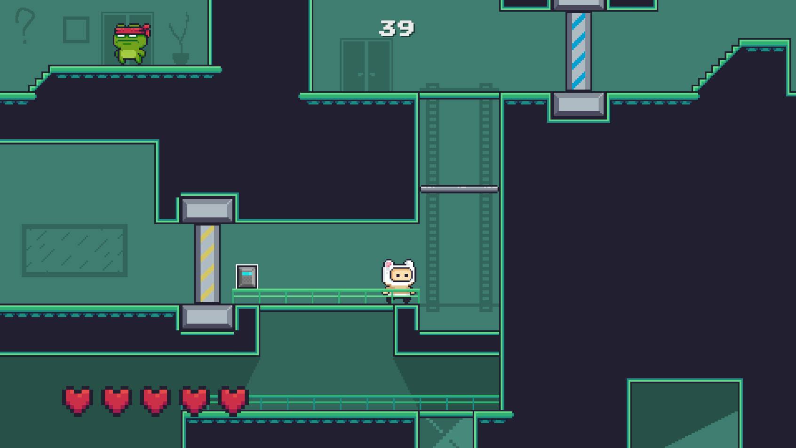

# Manek's Adventure

## Описание
Manek's Adventure - это стилизированный 2D **платформер** с одним уровнем. Версия 1.0 была сделана в качестве **курсовой работы по C#** для Tallinna Polütehnikum в 2019-ом году. 

Игровой движок: **`Unity 2020.1.14f1`** (все скрипты на **C#**)

Скачать игруможно по этой ссылке: [релиз 1.0 (Linux, MacOS, Windows)](https://github.com/xqrkushnir/Maneks-Adventure/releases/tag/1.0)

## Цель игры
Цель игры - это пройти уровень как можно быстрее.

## Управление
В игре отсутствует ознакомительный уровень, все клавиши для управления персонажем и игрой написаны тут:
* **Space** - Прыжок
* **A, D** - Движение влево/вправо
* **S** - Спуститься ниже (стоя на платформе)
* **F** - Взаимодействие (открытие дверей)
* **ESC** - Перезапуск уровня
* **Мышь 1** - Кинуть нож

Доступно только после подбора способности "Телепортация":
* **Мышь 2** (зажать) - Прицелиться телепортом
* **Мышь 1** (нажать, при прицеливании) - Переместиться 